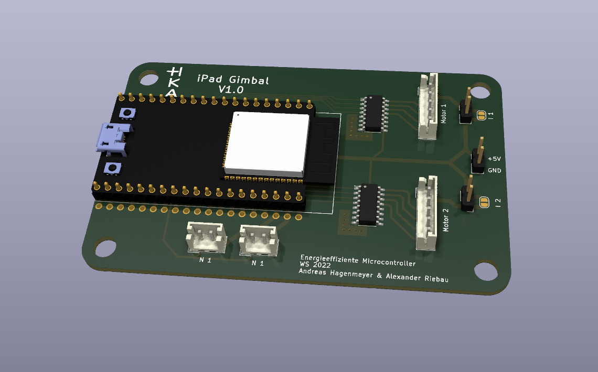

# iPad Gimbal - Energieeffiziente Mikrocontroller

Git repo für die Verwaltung des Schaltplans und des PCB layouts.

Schaltplan erstellt mittels KiCad

## ToDo:

- [x] Review Schaltplan
- [x] Review PCB Layout
- [x] Bestellung Komponenten
- [x] Bestellung PCB 
- [x] Löten der PCB
- [x] Inbetriebnahme
  
Projekt wurde im WS 22/23 abgeschossen. Die Enddokumentation des Projektes befindet sich im Teams-Kanal der Vorlesung

## 3D Ansicht PCB

  
